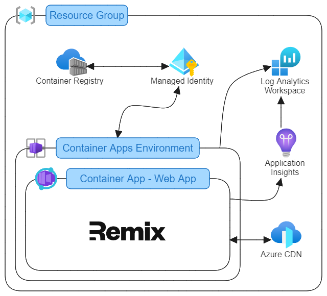

# remix-aca

An `azd` ([Azure Developer CLI](https://learn.microsoft.com/en-us/azure/developer/azure-developer-cli/overview)) template for getting a [Remix](https://remix.run/) app running on Azure Container Apps with CDN and Application Insights.

The Remix app included with the template has been generated with [`create-remix`](https://remix.run/docs/en/main/future/vite) using the Vite + Express template and has some additional code and components specific to this template that provide:

* [Server-side and client-side instrumentation and logging via App Insights](#application-insights)
* [Serving of Remix static assets through an Azure CDN (with cache busting)](#azure-cdn)
* [Support for custom domain names and automatic canonical host name redirect](#adding-a-custom-domain-name)
* [Support for checking the current environment at runtime](#checking-the-current-environment-at-runtime)

TODO: Mention Express config (CSP etc)? Robots and Sitemap?

Of course with this being an `azd` template you are free to build on top of the sample app, replace the sample app with your own, or cherry-pick what you want to keep or remove.

## Quickstart

The quickest way to try this `azd` template out is using [GitHub Codespaces](https://docs.github.com/en/codespaces) or in a [VS Code Dev Container](https://code.visualstudio.com/docs/devcontainers/containers):

[](https://codespaces.new/CMeeg/remix-aca)
[](https://vscode.dev/redirect?url=vscode://ms-vscode-remote.remote-containers/cloneInVolume?url=https://github.com/CMeeg/remix-aca)

Then from a Terminal:

```bash
# install dependencies
npm i

# create a `.env` file from the provided template
npm run env:init

# follow the prompts to sign in to your Azure account
azd auth login

# follow the prompts to provision the infrastructure resources in Azure
azd provision

# deploy the app to the provisioned infrastructure
azd deploy
```

> The output from the `azd deploy` command includes a link to the Resource Group in your Azure Subscription where you can see the provisioned infrastructure resources. A link to the Remix app running in Azure is also included.

🚀 You now have a Remix app running in Container Apps in Azure with a CDN for fast delivery of static files and Application Insights attached for monitoring!

Then when you're finished with the deployment run:

```bash
# delete the app and its infrastructure from Azure
azd down --purge
```

💥 That will delete the Resource Group and all of the resources in it.

## Setting up locally

If you do not have access to or do not want to work in Codespaces or a Dev Container you can of course work locally, but you will need to ensure you have the following pre-requisites installed:

* [Node.js](https://nodejs.org/) v18.17 or later
  * You can change this if you like, but this template currently targets Node 18
  * Use of [`nvm`](https://github.com/nvm-sh/nvm) or [`fnm`](https://github.com/Schniz/fnm) is recommended
* [PowerShell](https://github.com/PowerShell/PowerShell)
* [Azure Developer CLI](https://learn.microsoft.com/en-us/azure/developer/azure-developer-cli/install-azd)
* [Docker Desktop](https://www.docker.com/products/docker-desktop/)

> The template was developed on a Windows machine, and has been tested in a Linux environment (in the Dev Container). macOS is supported, but has not been tested.
>
> `azd` supports several [development environments](https://learn.microsoft.com/en-us/azure/developer/azure-developer-cli/supported-languages-environments#supported-development-environments). This template was developed in VS Code, and has been tested in GitHub Codespaces and Dev Containers (via VS Code). Visual Studio has not been tested.
>
> `npm` is used as it is the "safest" default. You should be able to switch out for the package manager of your choice, but only `npm` has been tested.

✔️ Once you have everything installed you can clone this repo and [start developing](#developing-your-app-with-this-template) or [deploy to Azure with the `azd` CLI](#deploying-to-azure-with-the-azd-cli).

## Developing your app with this template

You should develop your Remix app as [you normally would](https://remix.run/docs/en/main) with a couple of (hopefully minor) concessions:

* As and when environment variables need to be added to a `.env` file that the the `.env.template` file is updated to include a matching entry with an empty or default value
  * This is so that the `azd provision` and `azd deploy` hooks have context of all of the environment variables required by your app at build and at runtime
  * See the [Environment variables](#environment-variables) section for a fuller description of why this is needed
* To get the most out of the CDN and App Insights resources used by this template you should keep (or copy across) the relevant code and configuration assets related to these resources
  * See the [Azure CDN](#azure-cdn) and [Application Insights](#application-insights) sections for more information

> Some of the file and folder naming conventions used in this template are directly influenced by `azd` so it is a good idea to be familiar with those as renaming or moving things that [`azd` has a convention for](https://learn.microsoft.com/en-us/azure/developer/azure-developer-cli/make-azd-compatible?pivots=azd-create#azd-conventions) will break the `azd` commands used to provision and deploy your app.

## Deploying to Azure with the `azd` CLI

To deploy your app from your Terminal with `azd` run:

```bash
# install dependencies (if you have not already done so)
npm i

# follow the prompts to sign in to your Azure account (if you are not already signed in)
azd auth login

# create a `.env` file from the provided template (if you don't already have a `.env` file - this will be a no-op if you have)
npm run env:init

# follow the prompts to provision the infrastructure resources in Azure
azd provision

# deploy the app to the provisioned infrastructure
azd deploy
```

Then when you're finished with the deployment run:

```bash
# delete the app and its infrastructure from Azure
azd down --purge
```

## Deploying to Azure with `azd` in a CI/CD pipeline

This template supports automated provisioning and deployment of your application and its infrastructure via a CI/CD pipeline running in GitHub Actions or Azure DevOps via the same `azd` process that you can run locally:

* Please refer to the [Environment variables](#how-the-env-file-is-generated-when-running-in-a-pipeline) section of this document to read up on how environment variables are catered for inside CI/CD pipelines
* Please refer to the [Pipelines](#pipelines) section of this document for information on how to setup a CI/CD pipeline on either of the supported platforms

## Application Insights

The template includes instrumentation and components to enable server-side and client-side instrumentation and logging via App Insights when deployed to Azure.

### Server-side instrumentation and components

TODO: Write this section

### Client-side instrumentation and logging

TODO: Write this section

## Azure CDN

TODO: Write this section

## Checking the current environment at runtime

TODO: Write this section

## Environment variables

TODO: Write this section

### How `azd` uses environment variables in this template

When running `azd provision`:

1. A `preprovision` hook runs the `.azd/hooks/preprovision.ps1` script
   * The `.azd/scripts/azd-env-set-from-local.ps1` script runs
   * The entries from the `.env` file are read and passed to `azd env set`
2. `azd` runs the `main.bicep` file
   * The entries passed through `azd env set` in the `preprovision` hook are available for substitution in the `main.parameters.json` file via the [Input Parameters Substitution](https://learn.microsoft.com/en-us/azure/developer/azure-developer-cli/manage-environment-variables#input-parameters-substitution) feature of `azd`
   * The resolved values from the `main.parameters.json` file are passed to the `main.bicep` file as parameters
3. `azd` writes any `output`(s) from the `main.bicep` file to `.azure/{AZURE_ENV_NAME}/.env`
   * This is standard behaviour of `azd provision` and not specific to this template
4. A `postprovision` hook runs the `.azd/hooks/postprovision.ps1` script
   * The contents of the `.azure/{AZURE_ENV_NAME}/.env` file are merged with the `.env` file (if one exists) and the results are written to a `.env.azure` file
   * The `.env.azure` file will be used by `azd deploy`, specifically by the `Dockerfile`

> The `.env.azure` file should not be committed to your repo as it may contain secret or sensitive values from your `.env` file or the `azd provision` output.

When running `azd deploy`:

1. The `Dockerfile` copies the `.env.azure` files from the local disk and renames it `.env`
2. `npm run build` then runs, which may use the `.env` file

### How the `.env` file is generated when running in a pipeline

The `.env` file is required to provision, build and deploy the app, but it should never be committed to your repository and so is not available to the CI/CD pipeline when it clones your repo.

To overcome this problem the pipelines provided in this template are capable of generating an `env` file by reading environment variables from the pipeline build agent context and merging them with the `.env.template` file.

Exactly how the environment variables are surfaced to the build agent is slightly different depending on whether you are using an [Azure DevOps (AZDO)](#azure-devops-pipelines) or [GitHub Actions](#github-actions) pipeline due to the specific capabilities of each, but the approach used to generate the `.env` file is broadly the same:

1. The pipeline determines the target environment for the deployment based on the branch ref that triggered the pipeline to run
   * This can be extended to support multiple target environments
2. Environment variables specific to the target environment are loaded into the build agent context
   * These environment variables are named with the same keys used in the `.env.template` file
3. The pipeline runs `npm run env:init`, which merges the contents of the `.env.template` file with the environment variables in the build agent context and outputs the result to a `.env` file

⚡ `azd provision` and `azd deploy` then run as they would [locally](#how-azd-uses-environment-variables-in-this-template), using the `env` file created during the current pipeline run.

## Pipelines

This template includes support for running a CI/CD pipeline in GitHub Actions or Azure DevOps Pipelines. The specifics of the pipelines does differ due to the different capabilities and behaviour of each platform, but an effort has been made to keep the two pipelines broadly in line with each other so that the steps are comparable:

1. Determine the name of the target environment based on the branch ref that triggered the pipeline to run
   * E.g. `refs/heads/main` -> `production`
2. Load environment variables specific to the target environment in the pipeline's build context
3. Execute `npm run env:init` to [generate a `.env` file](#how-the-env-file-is-generated-when-running-in-a-pipeline) from the environment variables loaded into the build context
4. Run `azd provision`
5. Run `azd deploy`

Below are some instructions for how to setup and configure the pipelines included with this template for:

* [GitHub Actions](#github-actions)
* [Azure DevOps Pipelines](#azure-devops-pipelines)

> `azd` includes an `azd pipeline config` command that can be used to help initialise a pipeline on either platform. This is not recommended by this template because a) it requires creating target environments locally and having access to their environment variables, which doesn't "feel right" (i.e. having access to production secrets in a development environment doesn't feel right); and b) it creates "global" environment variables in GitHub, but this template recommends that you scope environment variables to specific target environments.
>
> Hopefully in future `azd` will offer hooks into the `azd pipeline` commands that allow for the below steps to be automated, but for now they are manual steps.

💡 The instructions below are written as if you are adding a `production` environment as that is assumed to be required and is catered for "out of the box" with the template, but you can add support for other environments also. For example you could map pipeline runs triggered by a push to a `canary` branch on your repo to a `uat` target environment.

### GitHub Actions

TODO: Run through this process and check it for correctness

You don't need to do anything specific to add the workflow in GitHub Actions, the presence of the `.github/workflows/azure-dev.yml` file is enough, but you will need to:

1. [Create an Environment](#create-an-environment)
2. [Setup permissions in Azure](#setup-permissions-in-azure) to allow GitHub Actions to create resources in your Azure subscription
3. [Add Environment variables](#add-environment-variables)
4. [Run the pipeline](#run-the-pipeline)

#### Create an Environment

1. Sign in to [GitHub](https://github.com/)
2. Find the repo where you have pushed your code, or your fork if you forked this repo
3. Go to `Settings` -> `Environments`
   * Click `New environment`, name it `production`, and click `Configure environment`
   * Add protection rules if you wish, though it's not required

> You can read more about creating environments in the [GitHub documentation](https://docs.github.com/en/actions/deployment/targeting-different-environments/using-environments-for-deployment#creating-an-environment). Note that there are limitations with Environments in GitHub if you are using a Free acount and your repository is private.

#### Setup permissions in Azure

1. Create a Service principal in Azure
   * Sign into the [Azure Portal](https://portal.azure.com)
   * Make sure you are signed into the tenant you want the pipeline to deploy to
   * Go to `Microsoft Entra ID` -> `App registrations`
   * Click `New registration`
   * Enter a `name` for your Service principal, and click `Register`
   * Copy the newly created Service principal's `Application ID` and `Directory (tenant) ID` - we will need those later
   * Go to `Certificates & secrets`
   * Select `Federated credentials` and click `Add credential`
   * Select the `GitHub Actions deploying Azure resources` scenario, and fill in the required information
     * `Organization`: your GitHub username
     * `Repository`: your GitHub repository name
     * `Entity type`: `Environment`
     * `GitHub environment name`: the environment name (`production`)
     * `Name`: a name for the scenario
       * e.g. `{Organization}-{Repository}-{GitHub environment name}`
   * Click `Add`
2. Give the Service principal the permissions required to deploy to your Azure Subscription
   * Go to `Subscriptions`
   * Select an existing or create a new Subscription where you will be deploying to
   * Copy the `Subscription ID` - we will need this later
   * Go to `Access control (IAM)` -> `Role assignments`
   * Assign the `Contributor` role
     * Click `Add` -> `Add role assignment`
     * Select `Privileged administrator roles` -> `Contributor`
     * Click `Next`
     * Click `Select members` and select your Service principal
     * Click `Review + assign` and complete the Role assignment
   * Assign the `Role Based Access Control Administrator` role
     * Click `Add` -> `Add role assignment`
     * Select `Privileged administrator roles` -> `Role Based Access Control Administrator`
     * Click `Next`
     * Click `Select members` and select your Service principal
     * Click `Next`
     * Select `Constrain roles` and only allow assignment of the `AcrPull` role
     * Click `Review + assign` and complete the Role assignment

#### Add Environment variables

1. Find and edit the Environment that you created in GitHub repo earlier
2. Add Environment variables
   * `AZURE_ENV_NAME=prod`
     * This doesn't need to match the GitHub Environment name and because it is used when generating Azure resource names it's a good idea to keep it short
   * `AZURE_TENANT_ID={tenant_id}`
     * Replace `{tenant_id}` with your Tenant's `Tenant ID`
   * `AZURE_SUBSCRIPTION_ID={subscription_id}`
     * Replace `{subscription_id}` with your Subscription's `Subscription ID`
   * `AZURE_CLIENT_ID={service_principal_id}`
     * Replace `{service_principal_id}` with your Service principal's `Application ID`
   * `AZURE_LOCATION={location_name}`
     * Replace `{location_name}` with your desired region name
     * You can see a list of region names using the Azure CLI: `az account list-locations -o table`
   * `SERVICE_WEB_APP_CONTAINER_MIN_REPLICAS=1`
     * Assuming that you don't want your production app to scale to zero
3. If you want to add additional variables (e.g. those found in the `.env.template` or `main.parameters.json` file) then you can continue to do so e.g. `SERVICE_WEB_APP_CONTAINER_MAX_REPLICAS=5`
   * If you don't add them then they will fallback to any default value set in the app or in the `main.bicep` file

💡 If you add additional environment variables for use in your app and want to override them in this environment then you can come back here later to add or change anything as needed.

TODO: Test the below - hopefully this isn't the case as it is an extra step that is a bit of a pain!

> If you add environment variables to `.env.template` you must also make sure you edit the `Create .env file` step of the `deploy` job in `.github/workflows/azure-dev.yml` to make them available as environment variables when `npm run env:init` is executed in the pipeline.
>
> GitHub Actions doesn't automatically make environment variables available to scripts so they need to be added explicitly to this step (this is something you don't need to do in the AZDO pipeline, which does expose its environment variables to scripts implicitly).

#### Run the pipeline

TODO: Write this

### Azure DevOps Pipelines

You need to manually create a pipeline in Azure DevOps - the presence of the `.azdo/pipelines/azure-dev.yml` file is not enough by itself - you will need to:

1. [Create the Pipeline](#create-the-pipeline)
2. [Setup permissions](#setup-permissions) to allow the Pipeline to create resources in your Azure subscription
3. [Create an Environment](#create-an-environment-1)
4. [Create a Variable group for your Environment](#create-a-variable-group-for-your-environment)
5. [Run the pipeline](#run-the-pipeline-1)

#### Create the Pipeline

1. Sign into [Azure DevOps](https://dev.azure.com)
2. Select an existing or create a new Project where you will create the pipeline
3. Go to `Pipelines` -> `Pipelines`
4. Click `New pipeline`
   * Connect to your repository
   * When prompted to `Configure your pipeline`, select `Existing Azure Pipelines YAML file` and select the `.azdo/pipelines/azure-dev.yml` file
   * `Save` (don't `Run`) the pipeline

#### Setup permissions

1. Create a Service connection for you Pipeline
   * Still in your Azure DevOps Project, go to `Project settings` -> `Service connections`
   * Click `New service connection`
     * Select `Azure Resource Manager`
     * Select `Service pincipal (automatic)`
     * Choose the `Subscription` that you wish to deploy your resources to
     * Don't select a `Resource group`
     * Name the Service connection `azconnection`
       * This is the default name used by `azd` - feel free to change it, but if you do you will need to update your `azure-dev.yml` file also
     * Add a `Description` if you want
     * Check `Grant access permissions to all pipelines`
       * You can setup more fine grained permissions if you don't wish to do this
     * Click `Save`
2. Give the Service connection the permissions required to deploy to your Azure Subscription
   * After your Service connection has been created, click on it to edit it
   * Click on `Manage Service Principal`, which will take you to the Service Principal in the Azure Portal
   * Copy the `Display name`
     * If you don't like the generated name you can go to `Branding & properties` and change the `Name`
   * Copy the Service principal's `Directory (tenant) ID` - we will need that later
   * Go back to your Service connection in Azure DevOps
   * Click on `Manage service connection roles`, which will take you to the Subscription in the Azure Portal
   * Go to `Role assignments`
   * Assign the `Role Based Access Control Administrator` role
     * Click `Add` -> `Add role assignment`
     * Select `Privileged administrator roles` -> `Role Based Access Control Administrator`
     * Click `Next`
     * On the `Members` tab, click `Select members`
     * Paste the `Display name` of your Service principal into the search
     * Select your Service principal
     * Click `Next`
     * On the `Conditions` tab, click `Select roles and principals`
     * Click `Configure` on `Constrain roles` and only allow assignment of the `AcrPull` role
     * Click `Save` x 2
     * Click `Review + assign` and complete the Role assignment
   * Go to the `Overview` tab of your Subscription
   * Copy the `Subscription ID` - we will need this later
   * Go back to your Service connection in Azure DevOps

#### Create an Environment

1. Still in your Azure DevOps Project, go to `Pipelines` -> `Environments`
2. Create a `production` environment
   * Add a `Description` if you want
   * For `Resource` select `None`
   * You can setup Approvals & checks if you wish

#### Create a Variable group for your Environment

1. Still in your Azure DevOps Project, go to `Pipelines` -> `Library`
2. Add a `Variable group` called `production`
3. Add the following variables:
   * `AZURE_ENV_NAME=prod`
     * This doesn't need to match the Environment name and because it is used when generating Azure resource names it's a good idea to keep it short
   * `AZURE_TENANT_ID={tenant_id}`
     * Replace `{tenant_id}` with your Tenant's `Tenant ID`
   * `AZURE_SUBSCRIPTION_ID={subscription_id}`
     * Replace `{subscription_id}` with your Subscription's `Subscription ID`
   * `AZURE_LOCATION={location_name}`
     * Replace `{location_name}` with your desired region name
     * You can see a list of region names using the Azure CLI: `az account list-locations -o table`
   * `SERVICE_WEB_APP_CONTAINER_MIN_REPLICAS=1`
     * Assuming that you don't want your production app to scale to zero
4. If you want to add additional variables (e.g. those found in the `.env.template` or `main.parameters.json` file) then you can continue to do so e.g. `SERVICE_WEB_APP_CONTAINER_MAX_REPLICAS=5`
   * If you don't add them then they will fallback to any default value set in the app or in the `main.bicep` file
5. Click `Save` to save the variable group and variables

💡 If you add additional environment variables for use in your app and want to override them in this environment then you can come back here later to add or change anything as needed.

> The first time you run the pipeline it will ask you to permit access to the `production` Environment and Variable group that you just created, which you should allow for the pipeline to run succesfully.

#### Run the pipeline

The pipeline is designed to run automatically by pushing commits to the `main` branch.

You can also run the pipeline manually:

* Go to `Pipelines` -> `Pipelines`
* Click your pipeline
* Click `Run pipeline`
* Select the `main` branch
* Click `Run`

## Adding a custom domain name

Azure supports adding custom domain names with free managed SSL certificates to Container Apps. The Bicep scripts included in this template are setup to provide this capability, but before we can add a custom domain name and managed certificate Azure requires that DNS records be created to verify domain ownership.

### Verify domain ownership

Azure requires that you add the following DNS records:

* A `TXT` record containing a domain verification code; and
* If you are using an apex domain, an `A` record containing the static IP address of the Container Apps Environment; or
* If you are using a subdomain, a `CNAME` record containing the FQDN of the Container App

To get the information that you require for these DNS records you can:

* When running `azd` locally
  * Run `azd provision` (if you have not already)
  * Check the output in your terminal
* When running `azd` in a pipeline
  * Run the pipeline (if you have not already)
  * Check the output of the `Provision infrastructure` task in the pipeline run logs

In the output you should find a line `[postprovision] === Container apps domain verification ===` and under that are 3 values that you need to create the DNS records:

* `Static IP`
* `FQDN`
* `Verification code`

You can use these values to add the DNS records as described in steps 7 and 8 of the [Container Apps documentation](https://learn.microsoft.com/en-us/azure/container-apps/custom-domains-managed-certificates?pivots=azure-portal#add-a-custom-domain-and-managed-certificate).

### Set your custom domain name

To set your custom domain name on your Container App you will need to add (or update) an environment variable named `SERVICE_WEB_APP_CUSTOM_DOMAIN_NAME`:

> For example, to set the domain name for the container app to `www.example.com` you would add an environment variable `SERVICE_WEB_APP_CUSTOM_DOMAIN_NAME=www.example.com`.

* In your local dev environment: to your `.env` file
* In GitHub Actions: as an [Environment variable](#add-environment-variables) in the target Environment (e.g. `production`)
* In Azure DevOps: as a [Variable in the Variable group](#create-a-variable-group-for-your-environment) for the target Environment (e.g. `production`)

You will then need to provision your infrastructure to add the domain name to your container app:

* When running `azd` locally
  * Run `azd provision`
* When running `azd` in a pipeline
  * Run the pipeline

> Ideally we would add the domain name and SSL certificate at the same time and automate it through Bicep, but unfortunately Azure makes this difficult to do because it doesn't allow you to create a managed certificate for a domain name that hasn't been added to the Container App, but you can't add a domain name binding without an SSL certificate. So the method documented here adds the domain name without a binding first, which allows the managed certificate and binding to be created in the next step. Hopefully [issues with managed certificates](https://github.com/microsoft/azure-container-apps/issues/607) will be addressed in future to allow for automation of this process.

### Add a free managed certificate for your custom domain

The final step is to create a free managed SSL certificate for your custom domain name and add it to your Container App:

1. Create the certificate
   * Sign in to the [Azure Portal](https://portal.azure.com)
   * Go to your Container Apps Environment resource
   * Go to `Certificates` -> `Managed certificate`
   * Click `Add certificate`
     * Select your `Custom domain` name
     * Choose the appropriate `Hostname record type`
     * `Validate` the custom domain name
     * `Add` the certificate
   * Azure will now provision the certificate
2. Get the `Certificate ID`
   * Wait for the `Certificate Status` to become `Succeeded`
   * The `Certificate ID` is not exposed in a convenient place in the Azure Portal, but you can work it out from the information provided:
     * Copy the `Certificate Name`
     * Go to `Overview` -> `JSON View`
     * Copy the `Resource ID`
     * Create the `Certificate ID` using the pattern:
       * `{Resource ID}/managedCertificates/{Certificate Name}`

You will then need to add (or update) an environment variable named `SERVICE_WEB_APP_CUSTOM_DOMAIN_CERT_ID` and with the value of your `Certificate ID`:

* In your local dev environment: to your `.env` file
* In GitHub Actions: as an [Environment variable](#add-environment-variables) in the target Environment (e.g. `production`)
* In Azure DevOps: as a [Variable in the Variable group](#create-a-variable-group-for-your-environment) for the target Environment (e.g. `production`)

And finally you will need to:

* When running `azd` locally
  * Run `azd provision`
  * Run `azd deploy`
* When running `azd` in a pipeline
  * Run the pipeline

⚡ The custom domain and SSL certificate will now be bound to your Container App.

💡 A redirect rule is automatically added so that if you attempt to navigate to the default domain of the Container App there will be a permanent redirect to the custom domain name - this redirect is configured in `./server/redirect.js`. The [`getAbsoluteUrl`](#azure-cdn) function provided by this template will also use the custom domain name you have set rather than the default domain of the Container App.

## Application architecture

TODO: Create the diagram

This template uses the following Azure resources:

* [Azure Container Apps](https://learn.microsoft.com/en-us/azure/container-apps/overview) to host the Remix app
* [Application Insights](https://learn.microsoft.com/en-us/azure/azure-monitor/app/app-insights-overview?tabs=net) for monitoring and logging
* [Azure CDN](https://learn.microsoft.com/en-us/azure/cdn/cdn-overview) for efficient serving of static application assets

Here's a high level architecture diagram that illustrates these components. Notice that these are all contained within a single [resource group](https://learn.microsoft.com/en-us/azure/azure-resource-manager/management/manage-resource-groups-portal) that will be created for you when you create the resources.



### Cost of provisioning and deploying this template

This template provisions resources to an Azure subscription that you will select upon provisioning them. Refer to the [Pricing calculator for Microsoft Azure](https://azure.microsoft.com/pricing/calculator/) to estimate the cost you might incur when this template is running on Azure and, if needed, update the included Azure resource definitions found in `infra/main.bicep` to suit your needs.

### Security

#### Managed Identity

This template creates a [Managed Identity](https://learn.microsoft.com/en-us/azure/active-directory/managed-identities-azure-resources/overview) for your app inside your Azure Active Directory tenant. It is used to permit the Container App to pull images from the Container Registry.

To view your managed identity in the Azure Portal follow these [steps](https://learn.microsoft.com/en-gb/azure/active-directory/managed-identities-azure-resources/how-to-view-managed-identity-service-principal-portal).
